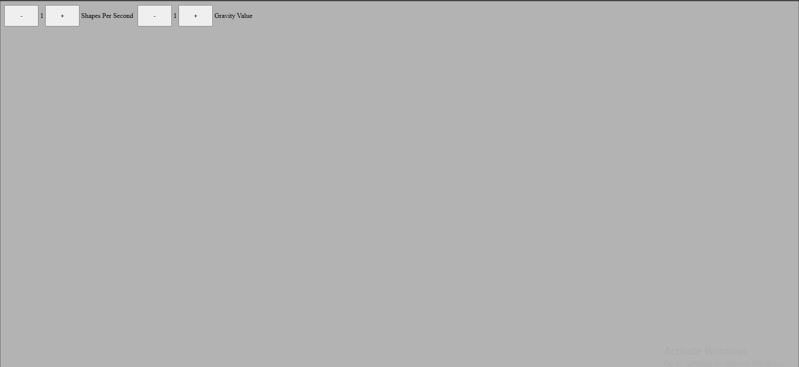

# DIGCODE

A falling shapes game built with PixiJS and TypeScript

---

## Table of Contents

- [Features](#features)
- [Prerequisites](#prerequisites)
- [Installation](#installation)
- [Project Structure](#project-structure)
- [Development](#development)
- [Build](#build)
- [Deployment](#deployment)
- [Controls](#controls)
- [Customization](#customization)
- [Contributing](#contributing)
- [License](#license)

---

## Features

- Spawn random shapes on click
- Shapes fall with adjustable gravity
- Multiple shape types: circle, square, triangle, cloud
- Click on shapes to remove them
- Adjustable spawn rate and gravity

---

## Prerequisites

Before you begin, ensure you have:

- [Node.js](https://nodejs.org/) (v18 or higher recommended)
- npm or yarn
- TypeScript installed globally (optional, you can also use local version):

```bash
npm install -g typescript


your-project/
├─ src/
│  ├─ controllers/
│  ├─ models/
│  ├─ view/
│  ├─ functions/
│  └─ main.ts
├─ package.json
├─ tsconfig.json
└─ README.md


npm run dev
# or
yarn dev


npm run build
# or
yarn build
```

## Screenshots / Working Example

*Main game empty screen*



*Main game screen with one shape*


*Main game screen with more than one shape*

